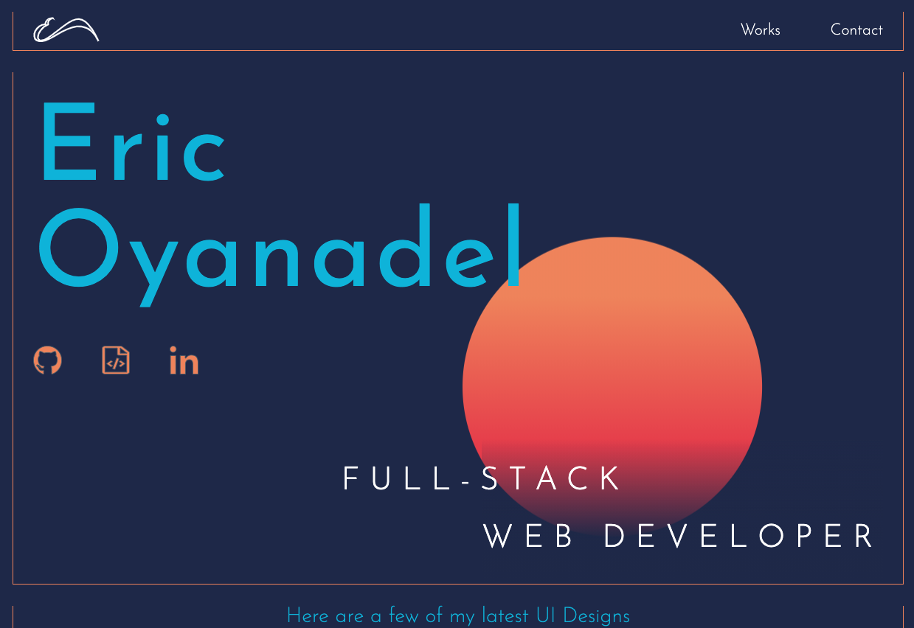

This Repository represents the Portfolio site of Eric Oyanadel, created with Gatsby using Graphql

Domain: Oyanadel.com

#Project run
`gatsby Build, Gatsby Develop`

## packages used

- [lightbox](https://www.npmjs.com/package/react-image-lightbox) for the image gallery
- Projects cards effect using [vanilla-tilt](https://www.npmjs.com/package/vanilla-tilt)
- GSAP GreenSock for sun animation

## gatsby plugins

- gatsby-transformer-sharp
- gatsby-plugin-sharp
- gatsby-plugin-json

[](https://app.netlify.com/sites/eoyanadel/deploys)



## Cool thing about this Portfolio
- on initial render of the page graphql is used as a middle layer to pull data from a local configuartion json file. 
EX:
```
export const data = graphql`
  query {
    file(relativePath: { eq: "computer_desk.JPG" }) {
      childImageSharp {
        fluid(maxWidth: 1000, quality: 100) {
          ...GatsbyImageSharpFluid
        }
      }
    }
    allUsesJson {
      nodes {
        usesInfo {
          id
          title
          content {
            id
            title
            url
            description
          }
        }
      }
    }
  }
`
```